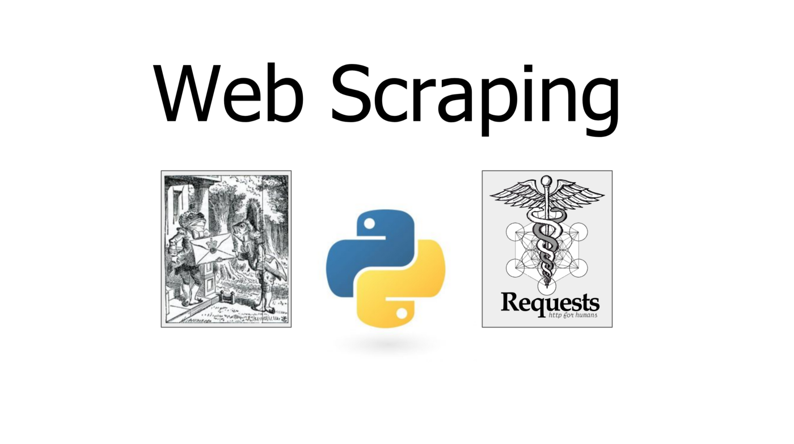

## **Mini-challenge de recrutement ETICien 👻**
### **Hello there !**

Ce repo est déstiné aux ETICiens dans le cadre du MP ETIC Bot 2.0. Veuillez suivre les étapes suivantes pour soumettre votre solution: 

#### **Ressources learning:**
> Dans le workshop du 12/11/2022 nous verrons ensemble comment faire le scraping de n'importe site web avec BeautifulSoup, pour populer une base de données qui servira aux Bots d'ETIC par la suite.

- D'abord je vous invite à lire le document accompagné au workshop pour installer les outils nécessaires. 

#### **Tutoriel et démo**
> Durant la séance, nous allons découvrir 3 choses :

- Les sites web qui offrent des API pour récupérer leurs contenus (y en a pas beaucoup), nous allons prendre l'exemple de tweepy. Nous allons voir l'implémentation de Rima Zourane (Alumni ETIC), n'oubliez pas de voir son repo [Repo tweepy test](https://github.com/rimazou/tweet_scrapper)

- Ensuite, nous allons voir comment utiliser BeautifulSoup qui nous permettera de récupérer le contenu sans API officielle d'un site web donné

- Et enfin, je vais vous montrer comment on va s'en servire de tout celà pour enrichir les fonctionalités de notre bot.
  
#### **Comment remettre l'exercice:**
> 1°/ Star Rima's repo sinon taqtelna xD (and this one too for the sake of our MP U.U)

> 2°/ Fork this repo and create a branch with your name

> 3°/ Create a file calles 'prénom_nom_scraper_site_choisi.py'

> 4°/ Create a pull request

#### **Deadline : 18/11/2022**

## **ETICiennement ! ❤️**